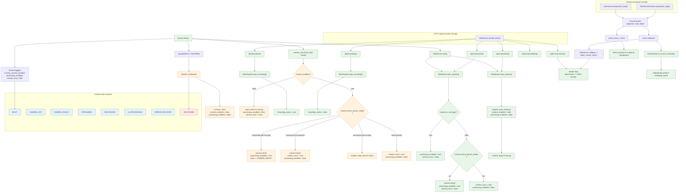

### How toggles are managed by threads, state and workflows Diagram.

```mermaid
flowchart TD
    A["main() startup"] --> T0["ServiceToggles<br/>running, camera_enabled,<br/>processing_enabled,<br/>camera_error, state"]
    A --> W["WebServer.start()"]
    A --> M["camera_reconnect_loop thread"]
    A --> S["signal(SIGINT / SIGTERM)"]

    subgraph StateMachine["Central state machine"]
        S0["BOOT"]
        S1["CAMERA_INIT"]
        S2["CAMERA_READY"]
        S3["STREAMING"]
        S4["RECORDING"]
        S5["AI_PROCESSING"]
        S6["ERROR_RECOVER"]
        S7["SHUTDOWN"]
    end

    T0 --> S0
    S --> SH["request_shutdown()"]
    SH --> S7
    SH --> R0["running = false<br/>camera_enabled = false<br/>processing_enabled = false"]

    M --> C1{"camera_enabled ?"}
    C1 -- false --> C2["stop camera if running<br/>processing_enabled = false<br/>camera_error = false"]
    C1 -- true --> C3{"camera.check_device_state() ?"}

    C3 -- "connected and !running" --> C4["camera.start()<br/>processing_enabled = true<br/>state -> CAMERA_READY"]
    C3 -- "running and !connected" --> C5["camera.stop()<br/>camera_error = true<br/>processing_enabled = false"]
    C3 -- "connected and running" --> C6["healthy: keep camera active"]
    C3 -- "disconnected" --> C7["camera_error = true<br/>processing_enabled = false"]

    W --> W1["WebServer.start_camera()"]
    W1 --> W2{"camera.is_running() ?"}
    W2 -- true --> W3["processing_enabled = true<br/>camera_error = false"]
    W2 -- false --> W4{"camera.check_device_state() ?"}
    W4 -- ok --> W5["camera.start()<br/>processing_enabled = true<br/>camera_error = false"]
    W4 -- fail --> W6["camera_error = true<br/>processing_enabled = false"]

    W --> W7["WebServer.stop_camera()"]
    W7 --> W8["request_stop_camera()<br/>camera_enabled = false<br/>processing_enabled = false"]
    W8 --> W9["camera.stop() if running"]

    subgraph ClientThreads["HTTP request worker threads"]
        H["WebServer.handle_client()"]
    end

    H --> H1["/api/camera/start"]
    H --> H2["/api/camera/stop"]
    H --> H3["/api/record/start"]
    H --> H4["/api/record/stop"]
    H --> H5["/api/camera/stream"]
    H --> H6["/api/camera/settings"]

    H1 --> W1
    H2 --> W7
    H3 --> B1["BaseSystem.start_recording()"]
    H4 --> B2["BaseSystem.stop_recording()"]
    H5 --> WS["stream loop<br/>latest frame -> JPEG encode"]

    subgraph CameraThreads["Camera acquisition threads"]
        USB["UsbCamera.acquisition_loop()"]
        RS["RealSenseCamera.acquisition_loop()"]
    end

    USB --> F1["FrameContext<br/>sequence, color, depth"]
    RS --> F1
    F1 --> L1["latest_frame_ cache"]
    F1 --> CB["frame callbacks"]

    CB --> B3["BaseSystem.on_frame_received()"]
    B3 --> WR["VideoWriter.write() if recording_active"]
    CB --> WStream["WebServer callback -> latest_stream_frame_"]
    WStream --> WS

    L1 --> GET["latest_frame() for snapshot / diagnostics"]
    B1 --> REC["recording_active = true"]
    B2 --> RECSTOP["recording_active = false"]

    classDef state fill:#e3f2fd,stroke:#1e88e5,stroke-width:1px;
    classDef action fill:#e8f5e9,stroke:#43a047,stroke-width:1px;
    classDef warn fill:#fff3e0,stroke:#fb8c00,stroke-width:1px;
    classDef stop fill:#ffebee,stroke:#e53935,stroke-width:1px;

    class S0,S1,S2,S3,S4,S5,S6,S7 state;
    class A,W,M,W1,W2,W3,W4,W5,W6,W7,W8,W9,H1,H2,H3,H4,H5,H6,B1,B2,B3,WS,WR,REC,RECSTOP,GET action;
    class C1,C2,C3,C4,C5,C6,C7,SH,R0 warn;
    class S7 stop;
```
