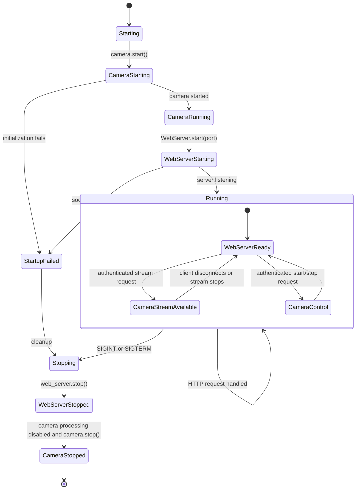
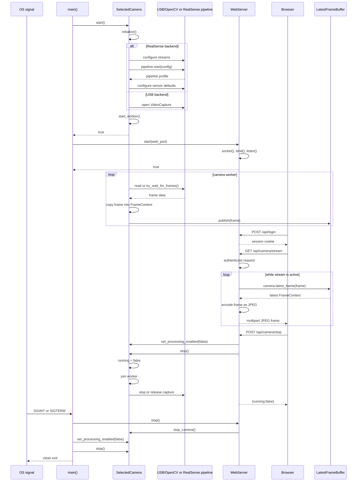

# Vision AI Box - Deep Blue AI Lab

docker run --rm -it \
  --privileged \
  --network host \
  -v /home/ghost/Desktop/core3:/home/ghost/core3 \
  -v /dev:/dev \
  doxchanger/private:vision_ai_box_builder \
  bash

Inside the container, switch to the project user before building:

```sh
su - ghost
cd /home/ghost/core3
```

```
# The same command with explicit HTTP port publishing instead of host networking:
# docker run --rm -it \
#   --privileged \
#   -p 8080:8080 \
#   -v /home/ghost/Desktop/core3:/home/ghost/core3 \
#   -v /dev:/dev \
#   doxchanger/private:vision_ai_box_builder \
#   bash
```

Build and run USB mode:

```sh
cmake -S . -B build-usb -DCMAKE_BUILD_TYPE=Release -DCAMERA=USB
cmake --build build-usb -j"$(nproc)"
./build-usb/vision_ai_box
```


Build and run RealSense mode:

```sh
cmake -S . -B build-realsense -DCMAKE_BUILD_TYPE=Release \
  -DCAMERA=REALSENSE -DLIBREALSENSE_DIR=/home/ghost/librealsense
cmake --build build-realsense -j"$(nproc)"
./build-realsense/vision_ai_box
```

```
export VISION_AI_BOX_USERNAME=admin
export VISION_AI_BOX_PASSWORD='admin'
export VISION_AI_BOX_PORT=8080
```

The embedded web server listens on port `8080` by default. Set
`VISION_AI_BOX_PORT` to select another port. Credentials default to
`admin` / `change-me`; configure them with `VISION_AI_BOX_USERNAME` and
`VISION_AI_BOX_PASSWORD` before starting the application.

Open `http://<device-ip>:8080/` from a device on the same network. The login
creates an HttpOnly session cookie and redirects to `/dashboard`. Protected
endpoints include `/api/camera/status`, `/api/camera/start`,
`/api/camera/stop`, and `/api/camera/stream`.

## Implementation Diagrams

### 1. Overview State Workflow



### 2. Detailed State Workflow

```mermaid
stateDiagram-v2
  [*] --> MainReady
  MainReady: Create ServiceToggles, Logger, and selected camera
  MainReady --> CameraConfiguring: camera.start()

  state CameraConfiguring {
    [*] --> StreamsConfigured
    StreamsConfigured: Configure color, optional depth, and alignment
    StreamsConfigured --> PipelineStarted
    PipelineStarted: pipeline.start(config) or VideoCapture.open()
    PipelineStarted --> SensorsConfigured: Camera opened
    SensorsConfigured: Configure auto exposure and auto white balance
    SensorsConfigured --> WorkerStarted
    PipelineStarted --> CameraInitFailed: RealSense error, standard exception, or open failure
  }

  CameraConfiguring --> CameraRunning: Worker thread started
  CameraInitFailed --> StartupFailed
  MainReady --> StartupFailed: camera.start() returns false

  state CameraRunning {
    [*] --> WaitingForFrames
    WaitingForFrames --> WaitingForFrames: poll or read next frame
    WaitingForFrames --> FramePublished: clone frame into FrameContext
    FramePublished: LatestFrameBuffer.publish(frame)
    FramePublished --> WaitingForFrames
    WaitingForFrames --> ProcessingPaused: processing disabled
    ProcessingPaused --> WaitingForFrames: processing enabled
  }

  CameraRunning --> WebStarting: WebServer.start(port)
  state WebStarting {
    [*] --> SocketCreated
    SocketCreated --> Listening: bind() and listen() succeed
    SocketCreated --> WebStartFailed: socket, bind, or listen fails
  }

  WebStarting --> ServingHTTP: server thread started
  WebStartFailed --> Shutdown

  state ServingHTTP {
    [*] --> AwaitingRequest
    AwaitingRequest --> LoginRequest: POST /api/login
    LoginRequest --> Authenticated: valid credentials; set session cookie
    LoginRequest --> AwaitingRequest: invalid credentials; return 401
    Authenticated --> DashboardRequest: GET /dashboard
    Authenticated --> StatusRequest: GET /api/camera/status
    Authenticated --> CameraStartRequest: POST /api/camera/start
    Authenticated --> CameraStopRequest: POST /api/camera/stop
    Authenticated --> StreamRequest: GET /api/camera/stream
    DashboardRequest --> AwaitingRequest: return HTML
    StatusRequest --> AwaitingRequest: return JSON status
    CameraStartRequest --> AwaitingRequest: start camera and return status
    CameraStopRequest --> AwaitingRequest: stop camera and return status
    StreamRequest --> ReadLatestFrame
    ReadLatestFrame: camera.latest_frame(frame)
    ReadLatestFrame --> EncodeJPEG: frame available
    ReadLatestFrame --> ReadLatestFrame: no frame; wait 25 ms
    EncodeJPEG: JPEG encoding
    EncodeJPEG --> SendMJPEG: send multipart JPEG
    SendMJPEG --> ReadLatestFrame: stream generation unchanged
    SendMJPEG --> AwaitingRequest: client disconnects or stream stops
  }

  CameraStartRequest --> CameraRunning: camera.start() succeeds
  CameraStopRequest --> CameraStopped: camera.stop()
  CameraStopped --> CameraRunning: camera.start() succeeds
  ServingHTTP --> Shutdown: SIGINT, SIGTERM, or WebServer.stop()

  StartupFailed --> Shutdown
  Shutdown: Stop server, disable processing, stop camera, join threads
  Shutdown --> [*]
```



### 3. Function Call Workflow

